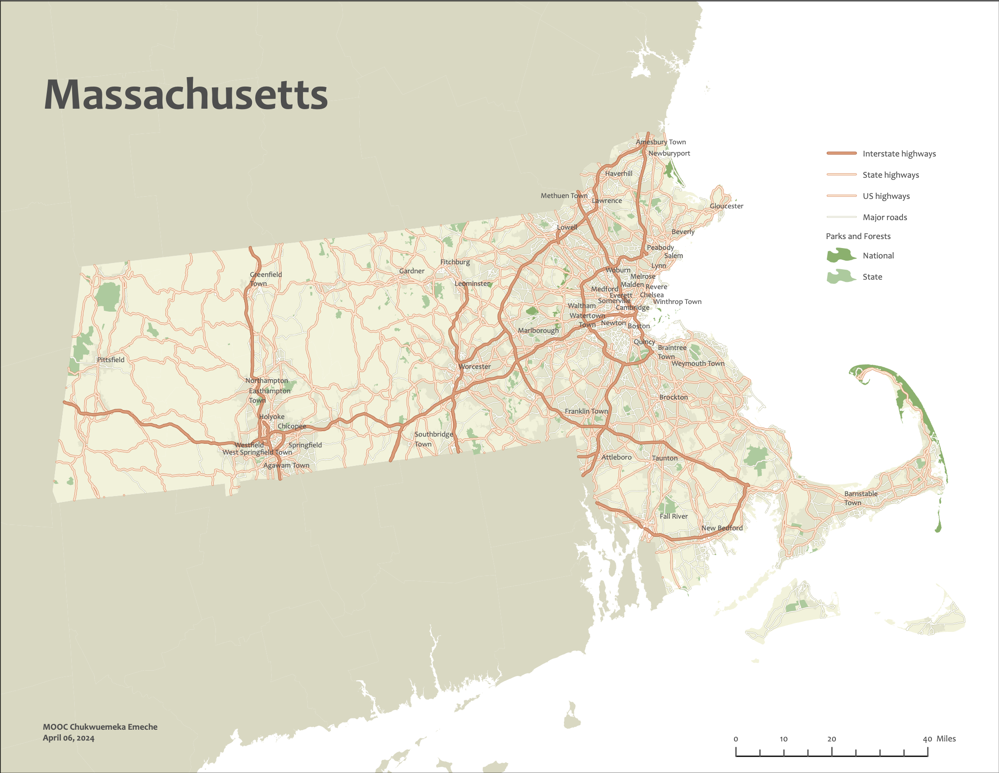

# Map of Massachusetts
A reference map depicting the state of Massachusetts, capturing its geographical and key administrative features in a compact format.

## How It's Made:

**Tech used:** ArcGIS Pro

I started by downloading the Massachusetts dataset and selecting the "Counties_northeast" layer, placing it at the bottom of the Contents pane. My goal was to make Massachusetts stand out on the map. To do this, I opened the Symbology pane from the Feature Layer tab and chose "Unique Values" to differentiate state names. I selected "STATE_NAME" from Field 1, removed all other states except Massachusetts, and assigned it a unique color to make it pop while the other states were represented with a default symbol.

Next, I adjusted the symbology for the states surrounding Massachusetts. I clicked the Format Symbol color swatch next to "All Other Values" in the Symbology pane, which opened the Format Polygon Symbol pane. Under the Properties tab, I went to the Color section and set the color model to CMYK, ideal for printing, and set the values to Cyan = 10%, Magenta = 10%, Yellow = 20%, and Black = 5%. I saved this style as "States" and set the outline to "No Color" with an outline width of 0 pt. This made all surrounding states appear in a uniform, muted green color, allowing Massachusetts to remain the focal point.

For Massachusetts, I created a custom color style by setting the CMYK values to Cyan = 5%, Magenta = 5%, Yellow = 15%, and Black = 0%, resulting in a lighter green that stood out against the darker surrounding states. This choice enhanced the visual hierarchy and ensured Massachusetts remained the map's primary focus.

I then moved on to the "UrbanArea_MA" layer, placing it second from the bottom. I zoomed in on this layer and applied 50% transparency to the "States" color, subtly highlighting urban areas without overwhelming other features. The outline color and width were also set to "No Color" and 0 pt to keep the map clean.

Next, I focused on the "Parks_MA" layer, where I differentiated public parks by type using their data attributes. I moved this layer above "UrbanAreas_MA" and applied "Unique Values" based on the FEATTYPE attribute. National Parks or Forests were given CMYK values of Cyan = 40%, Magenta = 20%, Yellow = 50%, and Black = 10%, saved as "National." State Parks or Forests were set to slightly softer colors, with values of Cyan = 30%, Magenta = 15%, Yellow = 35%, and Black = 5%, saved as "State." Local and Regional Parks were excluded to keep the focus on larger park areas, and I unchecked "Show All Other Values" to maintain a clean legend.

I then worked on the "Highways_MA" layer, placing it above the Public Lands layer. Using "Unique Values" with the "HwyClass" field, I symbolized different highway types. Interstate Highways were marked with a thick orange "Highway" symbol, while State and US Highways were represented with a lighter, thinner "Major Road" symbol. Minor Roads were represented with a "Minor Road" symbol for a more subtle visual distinction. To ensure these symbols appeared properly scaled, I set a map reference scale of 1:1,000,000, keeping the symbols proportional and consistent.

For the final touch, I enabled the Maplex Label Engine for advanced label placement. I used the "Places_MA" layer to label city names without using point symbols. To avoid clutter, I filtered out cities with populations under 15,000 using a definition query, reducing the labels to 51 cities, which significantly improved readability. I adjusted label placement to "Best Position" and enabled "Stack Label" under the Fitting Strategy tab. I chose a dark gray font to reduce contrast and ensure the labels did not overpower other map features.

Lastly, I set the Color and Outline of the "Places_MA" layer to "No Color," ensuring the labels didn’t overlap with other features.

This project not only effectively highlighted Massachusetts but also showcased my ability to handle complex symbology, data attributes, and label placement, resulting in a map that is both visually appealing and highly informative.

## Lessons Learned:

Through this project, I learned several valuable lessons that have significantly enhanced my GIS skills. I discovered the importance of utilizing unique symbology to make key features stand out, such as highlighting Massachusetts with a distinct color while using subdued tones for surrounding states. The process of converting the color model to CMYK for print maps emphasized the need for understanding different color models and their applications. I also gained experience in setting transparency levels to subtly display urban areas without overpowering other map elements. Differentiating public parks using data attributes and applying unique values demonstrated the power of data-driven symbology in creating informative maps. Adjusting highway symbology and ensuring the correct reference scale taught me how to maintain proportional and visually connected symbols. Finally, leveraging the Maplex Label Engine for advanced label placement highlighted the significance of precise label management to enhance map readability. This project not only refined my technical skills but also deepened my understanding of the principles of visual hierarchy and effective map design. Throughout the process, I was amazed by how simple features like transparency can create compelling maps by establishing visual hierarchy while simultaneously making the map more detailed. Additionally, using subtle color variations to draw attention to specific elements underscored the powerful impact of thoughtful design choices.

## Examples:
Take a look at these couple examples that I have in my own portfolio:

**Map of New York:** [Map of New York](https://github.com/T3ch12et/GIS-Data-Science-Portfolio/tree/main/ESRI-MOOC-Cartography/Map-of-New-York)

**Coral Reef Dashboard:** [Coral Reef Dashboard](https://github.com/T3ch12et/GIS-Data-Science-Portfolio/tree/main/ESRI-MOOC-GIS-for-Climate-Action/Coral-Reef-Dashboard)

**COVID Rates Map:** [COVID Interactive Rates Map](https://github.com/T3ch12et/GIS-Data-Science-Portfolio/tree/main/COVID-Interactive-Maps/COVID%20rates)

## Repositories
**Profile:** https://github.com/T3ch12et

**Cartography Repository:** [ESRI MOOC Cartography](https://github.com/T3ch12et/GIS-Data-Science-Portfolio/tree/main/ESRI-MOOC-Cartography)

**Main Repository:** https://github.com/T3ch12et/GIS-Data-Science-Portfolio
